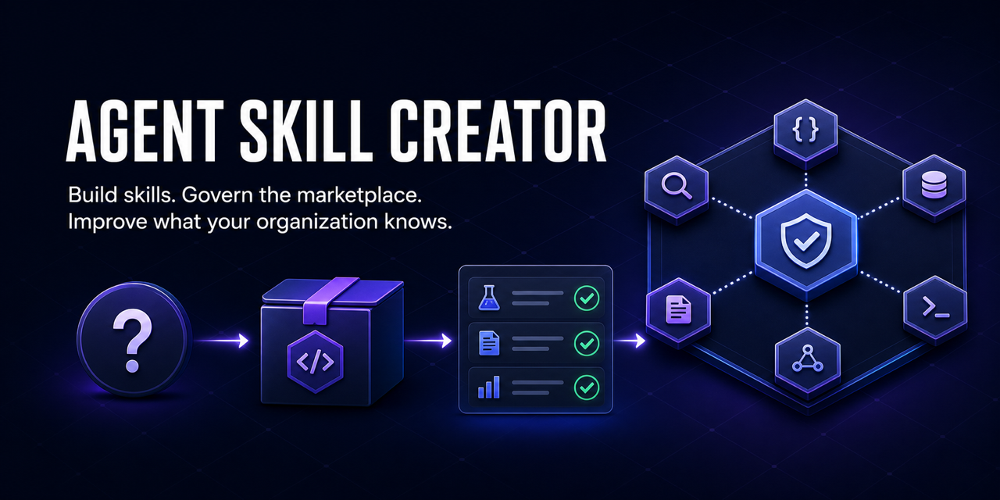

# Agent Skill Creator

**Build trusted agent skills. Govern their marketplace. Improve what your organization knows.**



[](https://github.com/FrancyJGLisboa/agent-skill-creator/actions/workflows/ci.yml)
[](https://github.com/anthropics/agent-skills-spec)
[](docs/INSTALL.md)
[]()
[]()

[Website](https://francyjglisboa.github.io/agent-skill-creator/) ·
[Installation](docs/INSTALL.md) ·
[Governed team marketplace](docs/TEAM_MARKETPLACE.md) ·
[Product scope](docs/PRODUCT_SCOPE.md) ·
[Organizational acceptance](docs/ORGANIZATIONAL_ACCEPTANCE.md) ·
[GitLab team registry](docs/GITLAB_TEAM_REGISTRY.md) ·
[Changelog](CHANGELOG.md)

Copyright © 2026 Francy J G Lisboa, also known as Charuto. See
[ownership](COPYRIGHT.md), [licence](LICENSE), and the required
[contributor assignment](CONTRIBUTOR_ASSIGNMENT.md).

Agent Skill Creator turns human expertise into tested, installable agent skills and
provides the operating system for managing those skills through a user-defined
marketplace.

Give it a sentence, spreadsheet, PDF, link, screenshot, transcript, or half-working
script. It reconstructs the judgment behind the work: the important question, when to
ask it, which decision the answer supports, what evidence makes the answer credible,
and how success will be measured. It then builds the skill, evaluates it, installs it,
and safely tries it on representative input.

For teams, the same system governs the complete lifecycle:

```text
create → attest → admit → approve → publish → discover → install
       → use → update → rollback → quarantine → retire
```

The result is more than a collection of prompts. It is a maintained map of which
questions an organization knows how to answer, which decisions it can support, and
whether those capabilities still work.

## What is an Agent Skill?

An Agent Skill is a reusable workflow package that guides an agent from a recognized
situation to a verified outcome. It can use retrieved knowledge, MCP tools, APIs,
deterministic scripts, and agent judgment, but it is not itself a RAG system, MCP
server, or agent runtime.

**RAG supplies knowledge. MCP supplies capabilities. The harness supplies execution.
A skill organizes them into a governed path toward a verified outcome.**

## Who it is for

| User | What they need | What this provides |
|---|---|---|
| **Workflow experts** | Preserve the judgment hidden inside recurring work | A skill built from existing artifacts, not a blank specification form |
| **AI platform teams** | Move from isolated prompts to supported capabilities | Evals, attestations, ownership, lifecycle controls, and health reporting |
| **Marketplace operators** | Publish and maintain skills without losing control | Admission gates, discovery, version-safe updates, rollback, and quarantine |
| **Regulated teams** | Show why a capability was trusted and which version ran | Commit-bound evidence, approvals, compatibility certification, and immutable releases |

## What makes a skill valuable

Answers are becoming inexpensive. The scarce asset is knowing which question matters
and what action should follow. Every generated skill therefore carries a required
decision contract:

```json
{
  "question": "Why did monthly revenue deviate from plan?",
  "trigger": ["Monthly close data is available"],
  "decision": ["Escalate a material variance", "Accept the reported result"],
  "evidence": ["Revenue ledger", "Approved operating plan"],
  "success_measure": "Every material variance has an evidence-backed owner and action"
}
```

Creation and marketplace admission fail when any of these fields is missing.

## The product in one view

| Layer | Job | Proof |
|---|---|---|
| **Skill factory** | Turn expertise and artifacts into executable skills | Validation, security scan, eval suite, representative run |
| **Marketplace operating system** | Govern publishing, discovery, installation, updates, and removal | Ownership, lifecycle state, immutable versions, rollback, quarantine |
| **Organizational learning system** | Improve capabilities from real corrections and outcomes | Evolution log, regression evidence, health reports, privacy-safe success metrics |

Every admitted skill also carries an operating contract: environment documentation,
data sources, readiness checks, least-privilege permissions, risk tier, mutation
boundary, and positive/negative routing tests. When business meaning affects
correctness, a conditional semantic contract adds authoritative definitions, ordered
source precedence, exact dependencies, ambiguity behavior, and owner-review freshness.
Installation plans expose this preflight instead of treating installation as proof of
readiness. Use the bounded [semantic-contract experiment](references/semantic-contract-experiment.md)
before expanding that capability.

Existing skills without `semantic_contract` remain valid and are interpreted as
`{"applies": false}` with a migration warning. Add that explicit value—or a complete
human-approved contract—before the skill's next release. Humans establish meaning;
the agent may structure, document, test, and apply it, but cannot make it authoritative.

The decisive product test is automated: create three skills, publish a remote tag,
discover from a clean consumer, install, invoke twice, update, roll back, quarantine,
and confirm installation is blocked. The repository's tests exercise the underlying
contracts for that lifecycle; the remaining standard is whether an unfamiliar team
can complete it without assistance.

The stronger organizational gate uses four blind, isolated roles: an administrator,
workflow expert, marketplace operator, and cross-department consumer. Follow the
[organizational acceptance protocol](docs/ORGANIZATIONAL_ACCEPTANCE.md); undocumented
assistance counts as failure, not success.

## Create your first skill

### 1. Choose your AI tool

| You use | Paste this in | Installation |
|---|---|---|
| **Claude Code** | Claude Code | `/plugin marketplace add FrancyJGLisboa/agent-skill-creator` then `/plugin install agent-skill-creator@agent-skill-creator` |
| **Codex, Cursor, Copilot, Gemini, or another supported tool on macOS/Linux** | Terminal | `curl -fsSL https://raw.githubusercontent.com/FrancyJGLisboa/agent-skill-creator/main/scripts/bootstrap.sh \| sh` |
| **Any supported tool on Windows** | PowerShell | `irm https://raw.githubusercontent.com/FrancyJGLisboa/agent-skill-creator/main/scripts/bootstrap.ps1 \| iex` |

The installer detects the AI tools already on your computer and installs the creator
in their native locations. For a single-tool install or the complete 17-platform list,
use the [installation guide](docs/INSTALL.md).

**Success check:** reopen your AI tool and ask `What can agent-skill-creator do?` It
should describe turning a workflow into a reusable skill.

### 2. Give it work you already have

Paste this in your AI tool—not in Terminal:

```text
/agent-skill-creator Every Friday I clean the CRM export, calculate regional
totals, and email a PDF sales report.
```

You can attach the CRM export, an old report, or the script you currently use. The
creator first gives you a short decision contract to confirm:

```text
Question: Which region needs attention this week?
Trigger: the Friday CRM export is available
Decision: investigate a variance or accept the reported totals
Evidence: the CRM export and reconciliation output
Success: every material variance has an owner and next action

Reply “yes” or correct the part I got wrong.
```

### 3. Judge the first result

The creator owns the technical work and reports four visible stages:

```text
Understand  ✓ workflow and success criteria confirmed
Build       ✓ reusable skill created
Check       ✓ structure, code, security patterns, and examples checked
Try         ✓ installed and run once on representative input
```

A successful handoff leads with the result:

```text
The weekly sales report now works from a CRM export.

Result: ./output/weekly-sales-report.pdf
Use it: /weekly-crm-report-skill data/crm-export.csv

Checks: structural requirements passed · 4 parallel checks passed · representative run passed
```

If a safe test needs credentials, data, or permission, the creator says
`verification-blocked` and gives one exact setup action. It does not send a real email,
publish, purchase, or write production data merely to prove the skill works.

If the result is wrong, describe the correction once:

```bash
python3 ./weekly-crm-report-skill/scripts/evolve.py --correct "UK sales arrive one day late"
```

The correction becomes part of the skill's maintained knowledge.

## What happens behind the four stages

You do not need this section to create a skill. It explains what the creator is doing
when you want to inspect the process.

Every skill is checked as one connected system. The skill graph links its
instructions, scripts, evaluations, and expected outputs. Two structural
requirements confirm that every expected result is tested and every predictable
multi-step workflow has one reliable entry point. Four checks—specification,
pipeline, security, and evaluation schema—run in parallel. Finally, a representative
run proves that the skill produces a useful result.

| What you see | What the factory does | Evidence left behind |
|---|---|---|
| **Understand** | Reads all material, reconstructs the workflow, identifies inputs, outputs, and success criteria | A plain-language hypothesis you approve or correct |
| **Build** | Researches sources, designs use cases, chooses the structure, writes instructions and functional scripts | A complete installable skill package |
| **Check** | Connects the package in a skill graph, applies two structural requirements, and runs four checks in parallel | A connected artifact map, requirement results, and reusable check evidence |
| **Try** | Installs to the detected tool and runs a safe representative example | An output you can inspect and correct |

Internally, Build covers the five engineering phases: discovery, design, architecture,
detection, and implementation. Details live in [the pipeline reference](references/pipeline-phases.md).

The graph is the release gate behind **Check**:

```bash
python3 scripts/skill_graph.py run ./the-skill/ --jobs 4
```

The two requirements have technical identifiers for automation.
`every_expected_is_reachable` prevents an expected output from sitting in the package
without participating in an evaluation. `deterministic_multistep_has_orchestrator`
requires a predictable multi-step skill to expose one reliable
`scripts/run_pipeline.py` entry point. Unchanged check results are reused by content
hash.

## What you receive

Every generated skill includes:

- A required question, trigger, supported decision, evidence contract, and measurable
  success condition in `discovery.json`.
- A focused `SKILL.md` and companion `AGENTS.md`.
- Functional scripts with one pipeline entry point when the workflow is sequential.
- Golden examples and regression checks, unless explicitly disabled with `--no-eval`.
- Validation, dependency, staleness, and correction tooling.
- A private local success ledger that measures verified creation, reuse, recovery,
  and durable activity without storing skill names or workflow content.
- Native installation support across 17 agent tools.

Generated skills use the Agent Skills Open Standard and invoke as `/skill-name` on
tools that support slash commands.

Inspect product success locally:

```bash
python3 scripts/success_ledger.py summary
```

The ledger has no network transport. Read the [event schema, privacy boundary, and
metric formulas](references/product-success.md), or set `ASC_SUCCESS_LEDGER=off` to
disable recording.

## Why the checks matter

The creator blocks delivery when required structure, pipeline compilation, declared
dependencies, or security checks fail. It scans for hardcoded secrets, dangerous code
patterns, prompt-injection indicators, hidden Unicode, encoded blobs, and undeclared
network endpoints.

**A clean scan is not proof of safety.** It means no known scanner pattern matched.
Skills execute with your filesystem access and available credentials, so imported
skills still require ordinary software-dependency judgment.

Audit a skill you did not create:

```text
/agent-skill-creator --audit ./downloaded-skill/
```

The audit reports what the skill reads, writes, and reaches; instruction-body risks;
and whether the code matches its description. A high-severity finding blocks install.
See [the skill-audit reference](references/skill-audit.md).

## Runnable examples

| Skill | Example request | Verified output |
|---|---|---|
| [weekly-crm-report](references/examples/weekly-crm-report/) | “Clean this CRM export and total sales by region” | Deduplicated regional totals |
| [pr-blocker-summarizer](references/examples/pr-blocker-summarizer/) | “Summarize my open PRs, blockers first” | Standup-ready blocker digest |
| [stock-analyzer](references/examples/stock-analyzer/) | “Analyze AAPL with RSI and MACD” | Indicators and a reasoned signal |

Try the smallest example without installing the creator:

```bash
git clone https://github.com/FrancyJGLisboa/agent-skill-creator
cd agent-skill-creator/references/examples/weekly-crm-report
python3 scripts/run_pipeline.py --input evals/golden/case-1/input.csv --output /tmp/summary.json
python3 scripts/run_evals.py --rollout
```

## The marketplace operating system

Users define the marketplace: its departments, owners, approval rules, supported
platforms, decision contracts, and success measures. Agent Skill Creator supplies the
control plane that makes those definitions executable.

Follow the [complete marketplace timeline](docs/TEAM_MARKETPLACE.md) for every command
in operational order: prerequisites, initialization, GitHub protection, skill intake,
review, release, discovery, installation, update, rollback, quarantine, and correction.

Create a central GitHub or GitLab repository for department-owned skills, reviewed
bundles, and version-pinned installs in VS Code Copilot Agent Mode:

```bash
python3 scripts/team_marketplace.py init \
  --name "ACME Skills" \
  --repository ACME/acme-skills \
  --department finance=finance-owner \
  --approver acme-platform \
  --supported-platform github-copilot \
  --starter-bundle analyst-starter \
  --marketplace ./acme-skills

python3 scripts/team_marketplace.py add ./report-skill \
  --department finance \
  --bundle analyst-starter \
  --marketplace ./acme-skills
```

The generated repository includes `registry.json` schema v2, question-first search,
structured skill pages, departmental paths, bundle manifests, `CATALOG.md`,
`CODEOWNERS`, governance instructions, scheduled health checks, and provider-native
CI. Add `--provider gitlab` and, for self-managed instances, `--host
gitlab.acme.test` during `init`. Admission blocks incomplete decision contracts and
failed validation, security, pipeline, eval, or attestation gates. It also rejects
path traversal, duplicate identities, undeclared network endpoints, embedded secrets,
instruction injection, and pre-approved `shell` or `bash` access.

Install an approved bundle at an immutable release:

```bash
python3 scripts/team_marketplace.py install \
  --bundle analyst-starter \
  --scope user \
  --pin v1.2.0 \
  --marketplace ./acme-skills
```

Install only one discovered skill with the same governance and version controls by
replacing `--bundle analyst-starter` with `--skill report-skill --department finance`.

Use `team_marketplace.py update` to re-gate a strictly newer semantic version. Use
`--scope project` for a repository-local install. Roll back by reinstalling an exact
previous tag with `--force`; quarantine immediately removes a skill from installable
states. GitHub installs into the consumer project. GitLab clones the exact protected
tag and copies the bundle into Copilot's user or project skill directory.

The [complete marketplace timeline](docs/TEAM_MARKETPLACE.md) is the canonical
operator page. The [distribution reference](references/distribution-guide.md#governed-github-copilot-marketplace)
contains the factory's internal routing and fallback behavior.

Use the [blind organizational acceptance protocol](docs/ORGANIZATIONAL_ACCEPTANCE.md)
to test the complete cross-team handoff in isolated sessions. It includes exact-tag
local testing, immutable release rules, an empty starter-bundle shape, and the
retire-and-recreate generation contract.

GitLab teams use the first-class [GitLab marketplace backend](docs/GITLAB_TEAM_REGISTRY.md),
including generated GitLab CI, `glab` releases, schema-v2 bundles, nested groups,
self-managed hosts, and pinned copy-based Copilot installation.

## Advanced capabilities

- [MCP capability audit](references/mcp-audit.md): map a vendor MCP server into buildable and missing skill opportunities.
- [Cross-platform export](references/export-guide.md): adapt an existing skill for supported tools.
- [Multi-agent suites](references/multi-agent-guide.md): create coordinated skills for genuinely distinct workflows.
- [Team distribution](references/distribution-guide.md): choose the governed Copilot marketplace or lightweight cross-Git registry.
- [Eval and evolution](references/phase2-eval-assessment.md): inspect golden cases, rollouts, holdouts, judges, and model comparisons.

## Contributing

Read [CONTRIBUTING.md](CONTRIBUTING.md), then run:

```bash
uv run pytest scripts/tests/ -q
uv run ruff check --target-version py310
```

Changes to installation scripts must preserve Bash/PowerShell parity. Changes to the
factory contract must keep `SKILL.md`, the pipeline, interactive guidance, distribution
guidance, README, and website aligned.

## License

MIT — see [LICENSE](LICENSE).
