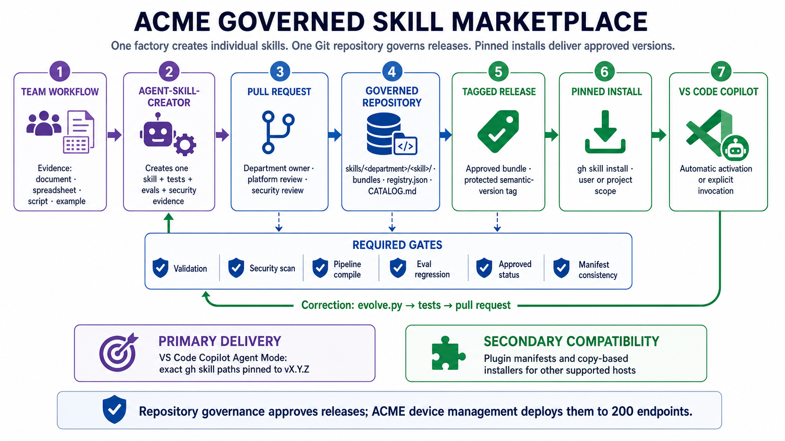

# Governed Team Skill Marketplace — Complete Timeline

Use this page from top to bottom. It contains every command needed to create an
ACME marketplace, admit individual skills, release approved bundles, install them
in VS Code Copilot Agent Mode, and update or roll them back.

## Choose the Git provider first

| ACME environment | Use |
|---|---|
| GitHub plus VS Code Copilot Agent Mode | Use the default `github` backend below. |
| GitLab.com | Add `--provider gitlab`; use the [GitLab command timeline](GITLAB_TEAM_REGISTRY.md). |
| Self-managed GitLab | Add `--provider gitlab --host <hostname>`; nested groups are supported. |

Both backends use the same schema-v2 bundles, quality gates, catalog, approval
evidence, CODEOWNERS, and immutable version pins. GitHub generates Actions and uses
`gh skill`; GitLab generates `.gitlab-ci.yml`, releases with `glab`, and installs
from a shallow clone at the exact tag.

```text
ONE-TIME SETUP                         REPEATED FOR EACH CHANGE

Prerequisites → Initialize → Protect   Create skill → Add → Review → Release
                                                            ↓
Correction ← Use ← Pinned install ← Approved semantic-version tag
```



## What each component does

| Component | Responsibility |
|---|---|
| `agent-skill-creator` | Creates and verifies one individual skill from workflow evidence. |
| Governed Git repository | Catalogs skills by department, runs gates, records approval, and builds bundles. |
| Provider backend | Uses `gh skill` on GitHub or tagged Git clone and copy on GitLab. |
| ACME device management | Runs the managed install command on approved endpoints. |

Plugins are a secondary compatibility channel for supported CLI hosts. For VS Code
Copilot Agent Mode, use the provider's pinned bundle install operation.

## Phase A — One-time platform setup

### A1. Confirm prerequisites

Run these commands on the platform developer's machine:

```bash
python3 --version
gh --version
gh auth status
gh skill --help
```

Required state:

- Python 3.10 or newer.
- Authenticated GitHub CLI 2.90 or newer.
- `gh skill` available. It remains a public-preview command.
- Permission to create and protect the target GitHub repository.

### A2. Initialize the marketplace

Run from the `agent-skill-creator` repository:

```bash
python3 scripts/team_marketplace.py init \
  --name "ACME Skills" \
  --repository ACME/acme-skills \
  --marketplace ./acme-skills
```

This creates:

```text
acme-skills/
├── skills/<department>/<skill>/
├── bundles/
├── scripts/team_marketplace.py
├── registry.json
├── CATALOG.md
├── CODEOWNERS
├── GOVERNANCE.md
└── .github/workflows/
```

To migrate an existing schema-v1 registry, initialize with one additional option:

```bash
python3 scripts/team_marketplace.py init \
  --name "ACME Skills" \
  --repository ACME/acme-skills \
  --from-registry ./legacy-registry \
  --marketplace ./acme-skills
```

Migration never grants approval. Migrated skills remain `draft` until their source,
owners, scripts, and quality evidence are reviewed.

### A3. Put the scaffold in GitHub

```bash
cd ./acme-skills
git init
git add -A
git commit -m "feat: initialize governed ACME skill marketplace"
gh repo create ACME/acme-skills --private --source=. --push
```

Do not add individual skills before the repository governance is configured.

### A4. Protect releases and reviews

Open `GOVERNANCE.md` in the generated repository. Configure the GitHub default
branch ruleset to require:

- Pull requests and CODEOWNER review.
- The `governed-marketplace` status check.
- Department-owner plus platform/security approval.
- No force pushes or branch deletion.

Configure a tag ruleset for `v*.*.*` that restricts tag creation, updates, and
deletion to release administrators. GitHub settings are required here; there is no
local command that can prove the organization applied its rulesets correctly.

## Phase B — Repeat for each individual skill

### B1. Create and verify one skill

In an installed agent environment, provide the real workflow evidence:

```text
/agent-skill-creator Create a skill from the attached ACME monthly reporting workflow.
```

Every skill is checked as one connected system. The skill graph links its
instructions, scripts, evaluations, and expected outputs. Two structural
requirements confirm that every expected result is tested and every predictable
multi-step workflow has one reliable entry point. Four checks—specification,
pipeline, security, and evaluation schema—run in parallel. Finally, a representative
run proves that the skill produces a useful result.

A skill is ready for marketplace intake only after both structural requirements, all
four checks, and the representative run pass.

Before `add`, its `SKILL.md` metadata must include real values:

```yaml
metadata:
  author: ACME Finance
  version: 1.2.0
  approval_status: approved
  owners: [acme-finance-skills]
```

Do not declare `allowed-tools: shell` or `allowed-tools: bash`. Copilot must request
runtime permission when a reviewed script actually needs execution.

### B2. Add the skill to a department and bundle

Run from the `agent-skill-creator` repository, pointing at the marketplace clone:

```bash
python3 scripts/team_marketplace.py add ./report-skill \
  --department finance \
  --bundle analyst-starter \
  --marketplace ./acme-skills
```

`add` runs the gates before copying. A failure stops intake. A successful add writes
the skill to `skills/finance/report-skill/`, updates `registry.json`, regenerates the
bundle manifest and catalog, and updates CODEOWNERS.

### B3. Run the repository check

```bash
python3 scripts/team_marketplace.py check \
  --marketplace ./acme-skills
```

The check refuses draft skills, failed gates, duplicate identities, missing owners,
unsafe tool pre-approval, path traversal, inconsistent metadata, and broken bundle
manifests.

### B4. Submit the governed change

```bash
cd ./acme-skills
git switch -c feat/add-finance-report-skill
git add -A
git commit -m "feat: add ACME finance report skill"
git push -u origin feat/add-finance-report-skill
gh pr create --fill
```

Department, platform, and security owners review the pull request. Merge only after
the generated GitHub Actions checks and required reviews pass.

## Phase C — Release and deliver approved bundles

### C1. Release an immutable version

Before the release pull request merges, record the reviewed release authorization:

```bash
python3 scripts/team_marketplace.py lifecycle report-skill \
  --department finance --to published --marketplace .
```

Commit that generated registry and catalog change through the normal review path.
After the pull request reaches the protected default branch:

```bash
git switch main
git pull --ff-only
python3 scripts/team_marketplace.py release \
  --tag v1.2.0 \
  --marketplace .
```

`release` reruns marketplace checks, requires a semantic-version tag, and calls
`gh skill publish`. Do not reuse or move an existing release tag.

### C2. Install the approved bundle

User scope makes the bundle available across the analyst's projects:

```bash
python3 scripts/team_marketplace.py install \
  --bundle analyst-starter \
  --scope user \
  --pin v1.2.0 \
  --marketplace ./acme-skills
```

Project scope installs it only for the current repository:

```bash
python3 scripts/team_marketplace.py install \
  --bundle analyst-starter \
  --scope project \
  --pin v1.2.0 \
  --marketplace ./acme-skills
```

The wrapper issues one exact command per bundled skill:

```bash
gh skill install ACME/acme-skills skills/finance/report-skill \
  --agent github-copilot \
  --scope user \
  --pin v1.2.0
```

The marketplace controls what may be installed. ACME endpoint management controls
how that command reaches 200 managed devices.

### C3. Update or roll back

Update by explicitly installing a newer approved release:

```bash
python3 scripts/team_marketplace.py install \
  --bundle analyst-starter \
  --scope user \
  --pin v1.3.0 \
  --force \
  --marketplace ./acme-skills
```

Roll back by reinstalling the last known-good tag:

```bash
python3 scripts/team_marketplace.py install \
  --bundle analyst-starter \
  --scope user \
  --pin v1.2.0 \
  --force \
  --marketplace ./acme-skills
```

There is no moving “latest” channel in the governed workflow. Every managed change
names the exact release that should be present.

### C4. Correct a skill through the repository

Never edit an installed copy. Capture the correction in the skill source:

```bash
python3 ./report-skill/scripts/evolve.py \
  --correct "ACME UK revenue closes one business day later"
```

Commit and attest the corrected source, then update the existing marketplace entry:

```bash
python3 scripts/team_marketplace.py update ./report-skill \
  --department finance --marketplace ./acme-skills
```

`update` requires a strictly newer semantic version and reruns validation, security,
pipeline, eval, clean-commit, and representative-run attestation gates before it
replaces any files. It preserves bundle membership, resets lifecycle to `approved`,
and clears compatibility certification because evidence from an older version cannot
certify the new payload. Open a pull request, obtain approval, re-certify supported
platforms, transition to `published`, release a new semantic-version tag, and install
the new pin.

## Command map

| When | Command | Result |
|---|---|---|
| Once | `team_marketplace.py init` | Creates the governed repository scaffold. |
| Every intake | `team_marketplace.py add` | Gates and copies one skill into a department and bundle. |
| Every new version | `team_marketplace.py update` | Re-gates a strictly newer version and preserves its bundles. |
| Before PR/release | `team_marketplace.py check` | Verifies the complete marketplace state. |
| After approved merge | `team_marketplace.py release --tag vX.Y.Z` | Publishes an immutable approved release. |
| Deployment/update/rollback | `team_marketplace.py install --pin vX.Y.Z` | Installs exact bundled skills for Copilot. |

## Trust evidence and lifecycle

Marketplace intake now requires executable evals and a representative-run
attestation bound to the exact, clean Git commit being submitted. After committing
the skill, create the evidence:

```bash
python3 scripts/team_marketplace.py attest ./report-skill \
  --run-id representative-2026-08-25 \
  --completed-at 2026-08-25T15:00:00Z
```

The skill lifecycle is `draft → in-review → approved → published`. Incident and
retirement paths add `quarantined`, `deprecated`, and `retired`. Only an authorized
transition is accepted:

```bash
python3 scripts/team_marketplace.py lifecycle report-skill \
  --department finance --to quarantined --marketplace ./acme-skills
```

Quarantined, deprecated, and retired skills cannot be installed. The
`approved → published` transition is committed before release so GitHub and GitLab
publish the exact reviewed registry state.

## Maintenance health control plane

GitHub marketplaces include a weekly `marketplace-health` workflow. GitLab includes
the equivalent scheduled-pipeline job. Run the same five checks locally:

```bash
python3 scripts/team_marketplace.py health --marketplace ./acme-skills \
  --output MARKETPLACE_HEALTH.md --json-output marketplace-health.json
```

The report covers review staleness, dependency evidence, eval regressions, active
owners, and current-version compatibility certification. Critical findings make the
command fail so scheduled automation can alert maintainers.

## Outcome-based discovery

Add `discovery.json` to each skill. The required decision contract names the
`question`, observable `trigger` conditions, supported `decision` choices, required
`evidence`, and `success_measure`. Also include the outcome, intended users, input
and output types, use cases, examples, permissions/systems, completion time,
compatibility claims, and support tier (`supported`, `community`, or `deprecated`).
Intake rejects missing or empty decision fields and generates one structured page
under `skill-pages/`.

```bash
python3 scripts/team_marketplace.py search "monthly revenue review" \
  --platform codex --support-tier supported --marketplace ./acme-skills
```

Search ranks outcome matches first and returns only published skills. Platform
filters require current-version certification rather than an unverified claim.

## Consented product measurement

Organizational metrics are off by default. Enable the closed, privacy-safe event
vocabulary with an expiring consent artifact:

```bash
python3 scripts/team_marketplace.py metrics-consent \
  --expires-at 2027-08-25T00:00:00Z --marketplace ./acme-skills
```

The local ledger records only salted skill IDs, event type, UTC time, success,
optional duration, and an allowlisted platform. It stores no prompts, inputs,
outputs, paths, people, or organization identifiers. Record activation and use from
approved runtime automation, then inspect aggregates:

```bash
python3 scripts/team_marketplace.py metrics-record activation \
  --skill report-skill --platform codex --marketplace ./acme-skills
python3 scripts/team_marketplace.py metrics-summary --marketplace ./acme-skills
```

## Distribution plans and compatibility certification

Generate a non-mutating plan before managed distribution. Remote plans require an
immutable tag matching the skill version or a full commit SHA:

```bash
python3 scripts/team_marketplace.py plan-install report-skill \
  --department finance --platforms codex,cursor,github-copilot \
  --scope user --release-ref v1.2.3 --marketplace ./acme-skills
```

Certification evidence names the platform, skill version, adapter and adapter
version, plus unique explicit checks whose `passed` values are true. Persist verified
evidence with:

```bash
python3 scripts/team_marketplace.py certify report-skill \
  --department finance --platform codex --evidence codex-evidence.json \
  --marketplace ./acme-skills
```

The adapters use `scripts/platforms.py` as the canonical platform registry. Native
and adapted artifact plans therefore stay aligned with the factory installers.
